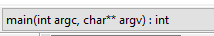
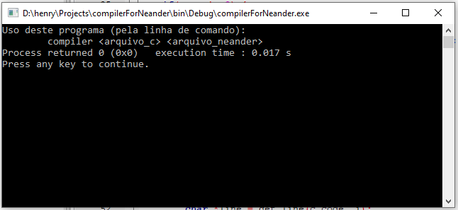
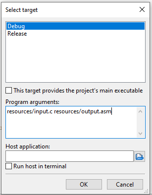
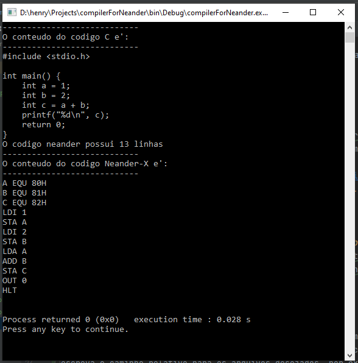

# Compiler for Neander

Seu objetivo neste trabalho é programar um compilador que traduza a linguagem de programação C para a linguagem 
Assembly Neander-X.

O objetivo principal é fazer com que, dado um conjunto **restrito** de instruções, o compilador consiga gerar uma saída
em código-fonte Assembly independente da ordem das instruções.

Por exemplo, se o usuário digitar

```C
int a = 1;
int b = 2;
```

ou então

```C
int b;
int a;
b = 2;
a = 1;
```

O compilador deve ser capaz de identificar corretamente os componentes e gerar a saída em Assembly. É disponibilizado 
um codigo-fonte de exemplo na função `compile` do arquivo [src/main.c](src/main.c). Este código-fonte **não está 
analisando** o texto de entrada, ele sempre gera o mesmo código-fonte de saída; você deve modificar esta função de 
maneira que a análise sintática e semântica sejam realizadas corretamente.

## Requisitos

Abaixo segue uma listagem das instruções em C que podem ser convertidas para Neander-X, bem como a nota que será 
atribuída caso você as implemente no seu trabalho. Tenha em mente que a nota deste trabalho é 10, portanto, mesmo que 
você implemente todos os itens da lista, a nota não ultrapassará este valor.

| Nota       | Descrição                                                     | Exemplo em C                                                                          | Instruções necessárias no Neander-X             |
|:-----------|:--------------------------------------------------------------|:--------------------------------------------------------------------------------------|:------------------------------------------------|
| **1 pt**   | Definição de variáveis                                        | `int a;`                                                                              | `EQU`                                           |
| **1 pt**   | Atribuição de valores                                         | `a = 1;`                                                                              | `LDI`, `STA`                                    |
| **1 pt**   | Definição e atribuição ao mesmo tempo                         | `int a = 1;`                                                                          | `EQU`, `LDI`, `STA`                             |
| **1 pt**   | Impressão na tela                                             | `printf("%d", c);`                                                                    | `LDA`, `OUT 0`                                  |
| **1 pt**   | Captura de entrada                                            | `scanf("%d", &d);`                                                                    | `IN 0`, `STA`                                   |
| **1 pt**   | Término do programa                                           | `return 0;`                                                                           | `HLT`                                           |
| **1 pt**   | Definição e soma entre variáveis                              | `int c = a + b;`                                                                      | `EQU`, `LDA`, `ADD`, `STA`                      |
| **1 pt**   | Definição e soma entre variável e constante                   | `int c = a + 1;`                                                                      | `EQU`, `LDI`, `ADD`, `STA`                      |
| **1 pt**   | Soma entre variáveis                                          | `c = a + b;`                                                                          | `LDA`, `ADD`, `STA`                             |
| **1 pt**   | Soma entre variável e constante                               | `c = a + 1;`                                                                          | `LDI`, `ADD`, `STA`                             |
| **1 pt**   | Definição e subtração entre variáveis                         | `int c = a - b;`                                                                      | `EQU`, `LDA`, `SUB`, `STA`                      |
| **1.5 pt** | Definição e subtração entre variável e constante (dois lados) | `int c = a - 1;` **e**<br>`int c = 1 - a;`                                            | `EQU`, `LDI`, `STA`, `LDA`, `SUB`               |
| **1 pt**   | Subtração entre variáveis                                     | `c = a - b;`                                                                          | `LDA`, `STA`, `SUB`                             |
| **1.5 pt** | Subtração entre variável e constante (dois lados)             | `c = a - 1;` **e**<br>`c = 1 - a;`                                                    | `EQU`, `LDI`, `STA`, `LDA`, `SUB`               |
| **5 pts**  | Multiplicação (qualquer configuração)                         | `int c = a * b;` **ou**<br>`c = a * b;` **ou**<br>`c = a * 3;` **ou**<br>`c = 3 * 2;` | `EQU`, `STA`, `LDA`, `LDI`, `JMP`, `SUB`, `JNZ` |


## Código-fonte de apoio

É disponibilizado um código-fonte de apoio, escrito em C. Portanto, o compilador que converte um arquivo escrito na 
linguagem de programação C para Neander-X também é escrito em C.

Você pode consultar o código-fonte disponível nos arquivos [include/utils.h](include/utils.h) e [src/main.c](src/main.c).
Desenvolva seu código-fonte no arquivo [src/main.c](src/main.c).

### Executando pelo Code::blocks

Abra o arquivo [compilerForNeander.cbp](compilerForNeander.cbp) pelo Code::blocks, selecione o arquivo [src/main.c](src/main.c),
selecione a função `main` no seletor , e clique em compilar e executar 
(botão  ou nos menus **Build > Build and Run**). 

Se a seguinte janela aparecer para você:



Será necessário configurar qual o arquivo de entrada e saída do programa (estes parâmetros são passados pela linha de 
comando. Para fazer isso, acesse o menu **Project > Set programs' arguments...**. Na janela que abrir,
escreva o caminho relativo para os arquivos desejados, por exemplo:



Após fazer isso, compile novamente o programa com  ou nos menus **Build > 
Build and Run** para ver a saída do programa:



Você pode, claro, definir os caminhos dentro do código-fonte, porém isto torna o compilador menos flexível.

## Problemas 

Caso você tenha algum problema durante a realização deste trabalho que você acredite que é um bug, entre em contato com 
o professor no e-mail henry.cagnini@gmail.com.

